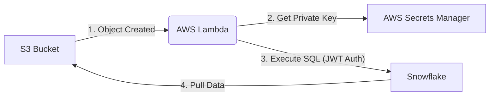

# s3-lambda-snowflake-data-ingestion-pipeline

This pipeline automates data ingestion from an S3 bucket into Snowflake using an AWS Lambda function. When a file (CSV) is uploaded to S3, the Lambda is triggered, authenticates with Snowflake using a JWT (Key Pair Authentication), and executes a SQL script to load the data.

## Why AWS Lambda?

While Snowflake is powerful, using an AWS Lambda function as the ingestion engine provides several critical advantages:

*   **Real-time Automation:** Lambda reacts instantly to S3 "Object Created" events. The moment a file is dropped into the bucket, the ingestion process begins without any manual intervention.
*   **Pre-Ingestion Validation:** The Lambda can perform complex validations on file names, formats, and data types before the data ever reaches Snowflake. This prevents "garbage" data from polluting your warehouse.
*   **Operational Efficiency:** By automating the mundane task of data loading, data scientists can spend 100% of their time on analysis and modeling rather than manual data plumbing.
*   **Extensibility:** Lambda allows you to easily add extra steps like notifying a Slack channel on failure, archiving files after processing, or triggering downstream Glue jobs.

## Architecture Overview



### Component Breakdown

1.  **S3 Bucket:** Acts as the landing zone for raw CSV data.
2.  **AWS Lambda:** The orchestration engine. It is triggered by S3, handles authentication, performs optional data validation, and instructs Snowflake to pull the data.
3.  **AWS Secrets Manager:** Securely stores the Snowflake RSA private key, ensuring no sensitive credentials are hardcoded or stored in environment variables.
4.  **Snowflake Storage Integration:** A native Snowflake object that allows it to securely access S3 using an IAM Role (no AWS Access Keys required).
5.  **Snowflake JWT Authentication:** Uses Key-Pair authentication for a secure, passwordless connection between Lambda and Snowflake.

## Prerequisites

### 0. Development Environment Setup
- **Install Node.js:** [Download and install](https://nodejs.org/) (needed for Serverless Framework).
- **Install Python:** [Download and install](https://www.python.org/) version 3.11.
- **Install AWS CLI:** 
  - Windows: `msiexec.exe /i https://awscli.amazonaws.com/AWSCLIV2.msi`
  - MacOS: `curl "https://awscli.amazonaws.com/AWSCLIV2.pkg" -o "AWSCLIV2.pkg" && sudo installer -pkg AWSCLIV2.pkg -target /`
  - Linux: Follow [AWS CLI Install Guide](https://docs.aws.amazon.com/cli/latest/userguide/getting-started-install.html).
- **Install Serverless Framework:**
  ```bash
  npm install -g serverless
  ```

### 1. AWS Account Setup
- **Create an AWS Account:** If you don't have one, sign up at [aws.amazon.com](https://aws.amazon.com/).
- **Configure AWS CLI:** Run `aws configure` and enter your Access Key ID and Secret Access Key.
- **IAM User:** Create an IAM user with appropriate permissions (S3, Lambda, Secrets Manager, CloudFormation) for the Serverless Framework to deploy.

### 2. Snowflake Account Setup
- **Create a Snowflake Account:** Sign up for a free trial at [snowflake.com](https://www.snowflake.com/).
- **Note your Account Identifier:** You will need this for the `SNOWFLAKE_ACCOUNT` environment variable. You can find it by running this in a Snowflake worksheet:
  ```sql
  SELECT CURRENT_ORGANIZATION_NAME() || '-' || CURRENT_ACCOUNT_NAME();
  ```
  It usually follows the format `orgname-accountname`.

### 3. Generate Key Pair for Authentication
Snowflake uses Key Pair authentication for the Lambda.
1. **Generate a private key:**
   ```bash
   openssl genrsa 2048 | openssl pkcs8 -topk8 -inform PEM -out rsa_key.p8 -nocrypt
   ```
2. **Generate a public key:**
   ```bash
   openssl rsa -in rsa_key.p8 -pubout -out rsa_key.pub
   ```
3. **Assign the Public Key to your Snowflake User:**
   Log in to Snowflake and execute:
   ```sql
   ALTER USER your_user_name SET RSA_PUBLIC_KEY='<PASTE_YOUR_PUBLIC_KEY_CONTENT_HERE>';
   ```
   *Note: Remove the `-----BEGIN PUBLIC KEY-----` and `-----END PUBLIC KEY-----` headers/footers and newlines when pasting.*

### 4. Store Private Key in AWS Secrets Manager
1. Go to the **AWS Secrets Manager** console.
2. Select **Store a new secret**.
3. Choose **Other type of secret**.
4. Select **Plaintext** tab and paste the entire content of `rsa_key.p8`.
5. Name the secret (e.g., `snowflake/private_key`). This name will be used as `SNOWFLAKE_PRIVATE_KEY_SECRET`.

### 5. Create IAM Role for Snowflake (Storage Integration)
Snowflake needs a role to assume to access your S3 bucket.
1. **Create an IAM Policy:**
   Go to IAM -> Policies -> Create Policy. Use this JSON (replace `your-bucket-name`):
   ```json
   {
       "Version": "2012-10-17",
       "Statement": [
           {
               "Effect": "Allow",
               "Action": ["s3:GetObject", "s3:GetObjectVersion"],
               "Resource": "arn:aws:s3:::your-bucket-name/*"
           },
           {
               "Effect": "Allow",
               "Action": ["s3:ListBucket", "s3:GetBucketLocation"],
               "Resource": "arn:aws:s3:::your-bucket-name"
           }
       ]
   }
   ```
2. **Create an IAM Role:**
   - Go to IAM -> Roles -> Create Role.
   - Select **AWS account** as the trusted entity.
   - Select **Another AWS account** and enter your own AWS Account ID (this is a placeholder; you'll update it later).
   - Require **External ID** (enter a placeholder like `0000`).
   - Attach the policy you created above.
   - Name the role (e.g., `SnowflakeS3Role`).
3. **Link to Snowflake:**
   - Run the `CREATE STORAGE INTEGRATION` command in `scripts/setup.sql` using the ARN of your new role.
   - Run `DESC INTEGRATION s3_integration;` in Snowflake.
4. **Update the Role's Trust Relationship:**
   - Go back to your IAM Role (`SnowflakeS3Role`) -> **Trust relationships** tab -> **Edit trust policy**.
   - Replace the `Principal` ARN with the `STORAGE_AWS_IAM_USER_ARN` from Snowflake.
   - Replace the `sts:ExternalId` with the `STORAGE_AWS_EXTERNAL_ID` from Snowflake.
   ```json
   {
     "Version": "2012-10-17",
     "Statement": [
       {
         "Effect": "Allow",
         "Principal": {
           "AWS": "<STORAGE_AWS_IAM_USER_ARN>"
         },
         "Action": "sts:AssumeRole",
         "Condition": {
           "StringEquals": {
             "sts:ExternalId": "<STORAGE_AWS_EXTERNAL_ID>"
           }
         }
       }
     ]
   }
   ```

## Snowflake Database Setup

Before running the pipeline, you need to set up the necessary database objects in Snowflake. The configuration is split into two parts:

### 1. Basic Object Creation
Run the commands in `scripts/setup.sql` in a Snowflake worksheet. This creates the database, table, role, and the storage integration.

```sql
-- See scripts/setup.sql for the complete script
-- Includes creation of DATABASE, SCHEMA, TRUCK_LOADS Table, and LAMBDA_INGEST_ROLE.
```

### 2. Integration Linkage & AWS Trust Setup
Run the commands in `scripts/integration_setup.sql`. This step grants the necessary permissions to your new role and provides the ARNs needed for your AWS IAM Trust Policy.

```sql
-- From scripts/integration_setup.sql
GRANT USAGE ON INTEGRATION s3_integration TO ROLE LAMBDA_INGEST_ROLE;
DESC INTEGRATION s3_integration;
```

*Important:* The output of `DESC INTEGRATION` contains the `STORAGE_AWS_IAM_USER_ARN` and `STORAGE_AWS_EXTERNAL_ID` that you must paste into your AWS IAM Role's Trust Policy (see Section 5.4 above).

The ingestion logic is defined in `ingest_from_s3.sql`. The Lambda dynamically injects the `bucket_name` and `file_key` into this script at runtime.

## Deployment

1. **Install Dependencies:**
   ```bash
   npm install
   pip install -r requirements.txt
   ```

2. **Configure Environment Variables:**
   Create a `.env` file or export the following variables:
   - `SNOWFLAKE_ACCOUNT`
   - `SNOWFLAKE_USER`
   - `SNOWFLAKE_PRIVATE_KEY_SECRET` (The name of the secret in AWS)
   - `SNOWFLAKE_DATABASE`
   - `SNOWFLAKE_SCHEMA`
   - `SNOWFLAKE_WAREHOUSE`
   - `SNOWFLAKE_ROLE`
   - `SOURCE_BUCKET_NAME`

3. **Deploy with Serverless:**
   ```bash
   serverless deploy
   ```

## How it works
1. Data is uploaded to the specified S3 bucket.
2. S3 triggers the `ingestToSnowflake` Lambda function.
3. The Lambda retrieves the Snowflake private key from AWS Secrets Manager.
4. The Lambda connects to Snowflake and executes the SQL commands in `ingest_from_s3.sql`.

## Troubleshooting

### Common Issues

1.  **Authentication Error (JWT):**
    *   Ensure the private key in AWS Secrets Manager is the **Plaintext** version of the `.p8` file.
    *   Verify that the Public Key assigned to the Snowflake user matches the private key (no headers/footers when pasting into Snowflake).
2.  **Access Denied (S3 to Snowflake):**
    *   Double-check the AWS IAM Role Trust Relationship. The `STORAGE_AWS_IAM_USER_ARN` and `STORAGE_AWS_EXTERNAL_ID` must be exactly what `DESC INTEGRATION` returns.
    *   Ensure the S3 bucket name in the IAM Policy matches your actual bucket.
3.  **Lambda Permissions:**
    *   The Lambda role (created by Serverless) must have `secretsmanager:GetSecretValue` permission for the specific secret.

## Verification: The Ultimate Goal

Once the pipeline is deployed and you upload a CSV file (like `test_truck_data.csv`) to your S3 bucket, the ultimate goal is to see the data appearing automatically in Snowflake.

Log in to your Snowflake worksheet and run:
```sql
SELECT * FROM TRUCK_LOADS;
```
If everything is configured correctly, you should see the rows from your CSV file reflected in the table!
